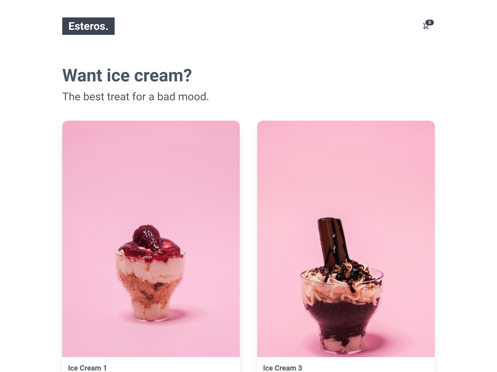
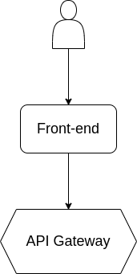

# Esteros

[](https://github.com/hapakaien/esteros/actions/workflows/main.yml)

**Esteros** is a microservices demo application. Esteros consists of 4
microservices applications and a front-end. This app is a web-based online ice
cream shop where users can search for the ice cream they like, add it to their
cart, and purchase it.

This app was created to demonstrate the use of Redis in modern web development.



[Click here](./data/photos/) for more screenshots.

## How it works

### Architecture

**Esteros** is composed of 4 microservices written in TypeScript (Node.js) that
talk to each other over [Redis Pub/Sub](https://redis.io/docs/manual/pubsub/).



| Service                                  | Language             | Description                                                                                                                                    |
| ---------------------------------------- | -------------------- | ---------------------------------------------------------------------------------------------------------------------------------------------- |
| [front-end](./src/frontend)              | Svelte (TypeScript)  | Exposes an HTTP server to serve the website. Does not require signup/login and generates cookie-based session IDs for all users automatically. |
| [api-gateway](./src/api-gateway)         | Node.js (TypeScript) | Connecting all back-end microservices into one REST API.                                                                                       |
| [product-service](./src/product-service) | Node.js (TypeScript) | Provides the list of products from a RedisJSON and ability to search products and get individual products.                                     |
| [cart-service](./src/currencyservice)    | Node.js (TypeScript) | Add the product to the Redis Cache for a user with a specific session ID, then make it available for that user.                                |
| [order-service](./src/paymentservice)    | Node.js (TypeScript) | Create an order from an existing cart with a mocked data.                                                                                      |

### How the data is stored

Refer to [this example](https://github.com/redis-developer/basic-analytics-dashboard-redis-bitmaps-nodejs#how-the-data-is-stored) for a more detailed example of what you need for this section.

### How the data is accessed

Refer to [this example](https://github.com/redis-developer/basic-analytics-dashboard-redis-bitmaps-nodejs#how-the-data-is-accessed) for a more detailed example of what you need for this section.

## How to run it locally?

To run this app in local environment, you can use below method.

### Prerequisites

- **Git** - Latest stable version is recommended.
- **Node.js** - v16 or higher
- **pnpm** - v7.8.0 or higher
- **Docker Compose** (or **Podman Compose**) - v1 or higher

> I personally use Podman Compose to manage all the Containers, but you should
> also be able to use Docker Compose as they both have similar APIs.

### Local installation

1. Using the terminal of your choice, please move to the directory you want to
   run this application.

   ```bash
   cd <your-dicrectory>
   ```
  
2. Clone this repository, and move to the cloned folder.

   ```bash
   git clone -b main --depth 1 --single-branch https://github.com/hapakaien/esteros.git && cd esteros
   ```

3. Run all necessary containers with Docker Compose.

   ```bash
   docker-compose up -d
   ```

4. Create a bucket named "local" in Minio by visiting http://localhost:8900, and
   make it public access.

5. Upload all initial data to Redis and Minio.

    ```bash
    pnpm run setup
    ```

6. Install all dependencies in this monorepo.

   ```bash
   pnpm install
   ```

7. Build all code.

   ```bash
   pnpm build
   ```

8. Run the application that you built earlier.

   ```bash
   pnpm start:prod
   ```

9.  Now you can visit http://localhost:8080 to try this app.

## More Information about Redis Stack

Here some resources to help you quickly get started using Redis Stack. If you still have questions, feel free to ask them in the [Redis Discord](https://discord.gg/redis) or on [Twitter](https://twitter.com/redisinc).

### Getting Started

1. Sign up for a [free Redis Cloud account using this link](https://redis.info/try-free-dev-to) and use the [Redis Stack database in the cloud](https://developer.redis.com/create/rediscloud).
1. Based on the language/framework you want to use, you will find the following client libraries:
    - [Redis OM .NET (C#)](https://github.com/redis/redis-om-dotnet)
        - Watch this [getting started video](https://www.youtube.com/watch?v=ZHPXKrJCYNA)
        - Follow this [getting started guide](https://redis.io/docs/stack/get-started/tutorials/stack-dotnet/)
    - [Redis OM Node (JS)](https://github.com/redis/redis-om-node)
        - Watch this [getting started video](https://www.youtube.com/watch?v=KUfufrwpBkM)
        - Follow this [getting started guide](https://redis.io/docs/stack/get-started/tutorials/stack-node/)
    - [Redis OM Python](https://github.com/redis/redis-om-python)
        - Watch this [getting started video](https://www.youtube.com/watch?v=PPT1FElAS84)
        - Follow this [getting started guide](https://redis.io/docs/stack/get-started/tutorials/stack-python/)
    - [Redis OM Spring (Java)](https://github.com/redis/redis-om-spring)
        - Watch this [getting started video](https://www.youtube.com/watch?v=YhQX8pHy3hk)
        - Follow this [getting started guide](https://redis.io/docs/stack/get-started/tutorials/stack-spring/)

The above videos and guides should be enough to get you started in your desired language/framework. From there you can expand and develop your app. Use the resources below to help guide you further:

1. [Developer Hub](https://redis.info/devhub) - The main developer page for Redis, where you can find information on building using Redis with sample projects, guides, and tutorials.
1. [Redis Stack getting started page](https://redis.io/docs/stack/) - Lists all the Redis Stack features. From there you can find relevant docs and tutorials for all the capabilities of Redis Stack.
1. [Redis Rediscover](https://redis.com/rediscover/) - Provides use-cases for Redis as well as real-world examples and educational material
1. [RedisInsight - Desktop GUI tool](https://redis.info/redisinsight) - Use this to connect to Redis to visually see the data. It also has a CLI inside it that lets you send Redis CLI commands. It also has a profiler so you can see commands that are run on your Redis instance in real-time
1. Youtube Videos
    - [Official Redis Youtube channel](https://redis.info/youtube)
    - [Redis Stack videos](https://www.youtube.com/watch?v=LaiQFZ5bXaM&list=PL83Wfqi-zYZFIQyTMUU6X7rPW2kVV-Ppb) - Help you get started modeling data, using Redis OM, and exploring Redis Stack
    - [Redis Stack Real-Time Stock App](https://www.youtube.com/watch?v=mUNFvyrsl8Q) from Ahmad Bazzi
    - [Build a Fullstack Next.js app](https://www.youtube.com/watch?v=DOIWQddRD5M) with Fireship.io
    - [Microservices with Redis Course](https://www.youtube.com/watch?v=Cy9fAvsXGZA) by Scalable Scripts on freeCodeCamp
